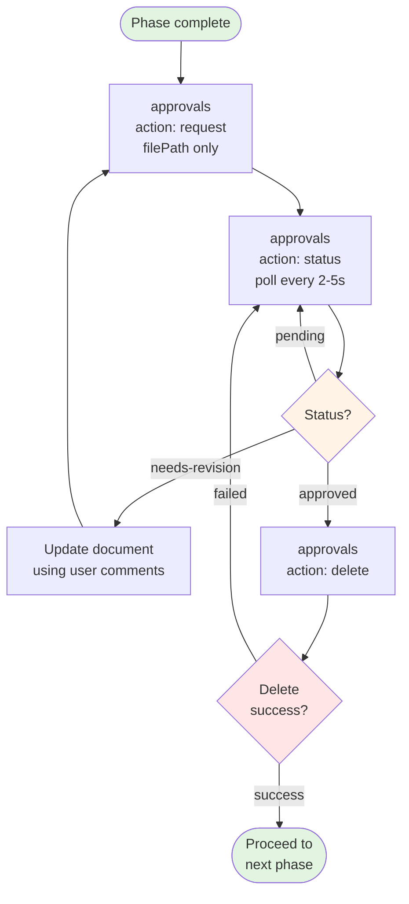

# Approval Workflow Pattern

## Overview

The spec-workflow approval system is BLOCKING - all phase transitions require explicit dashboard or VS Code extension approval. This pattern is used consistently across all workflow phases.

## Standard Approval Sequence

### Step 1: Request Approval
```typescript
// Create approval request
approvals({
  action: 'request',
  category: 'spec' | 'steering',
  categoryName: specName,
  filePath: 'relative/path/to/file.md',  // NEVER include content
  title: 'Brief description',
  type: 'document'
})
```

**Critical Rules**:
- Provide `filePath` only, NEVER include document content
- Dashboard reads files directly from filesystem
- Returns `approvalId` for status polling

### Step 2: Poll Status
```typescript
// Check approval status (poll every 2-5 seconds)
approvals({
  action: 'status',
  approvalId: id
})
```

**Possible States**:
- `pending`: Waiting for user review
- `approved`: User approved, proceed to cleanup
- `needs-revision`: User requested changes

**Actions by State**:
- `pending`: Continue polling (do NOT proceed)
- `approved`: Proceed to Step 3 (cleanup)
- `needs-revision`: Update document using user comments, create NEW approval request (return to Step 1)

### Step 3: Cleanup (BLOCKING)
```typescript
// Delete approval after receiving "approved" status
approvals({
  action: 'delete',
  approvalId: id
})
```

**Critical Rules**:
- MUST succeed before proceeding to next phase
- If delete fails: return to Step 2 (continue polling)
- NEVER proceed to next phase if cleanup fails

## Complete Flow Diagram



## Common Mistakes to Avoid

### Mistake 1: Accepting Verbal Approval
```
User: "Looks good, approved!"
AI: Proceeding to next phase...  ❌ WRONG
```

**Correct Behavior**:
```
User: "Looks good, approved!"
AI: Polling approval status via system...
    Status: pending (user must approve via dashboard)
    Continuing to poll...  ✅ CORRECT
```

### Mistake 2: Including Content in Request
```typescript
approvals({
  action: 'request',
  filePath: 'specs/feature/requirements.md',
  content: '# Requirements...'  // ❌ WRONG - never include content
})
```

**Correct Behavior**:
```typescript
approvals({
  action: 'request',
  filePath: 'specs/feature/requirements.md'  // ✅ CORRECT - filePath only
})
```

### Mistake 3: Proceeding Without Cleanup
```typescript
// Status returns "approved"
// AI immediately proceeds to next phase  ❌ WRONG
```

**Correct Behavior**:
```typescript
// Status returns "approved"
approvals({ action: 'delete', approvalId: id })
// Check delete success
if (success) {
  // Proceed to next phase  ✅ CORRECT
}
```

### Mistake 4: Reusing Same Approval After Revision
```typescript
// Status: needs-revision
// Update document
// Continue polling same approvalId  ❌ WRONG
```

**Correct Behavior**:
```typescript
// Status: needs-revision
// Update document
// Create NEW approval request with action:'request'  ✅ CORRECT
```

## Integration with Phases

### Requirements Phase
```
1. Create requirements.md
2. Request approval
3. Poll until approved (handle needs-revision)
4. Delete approval (BLOCKING)
5. Proceed to Design Phase
```

### Design Phase
```
1. Create design.md
2. Request approval
3. Poll until approved (handle needs-revision)
4. Delete approval (BLOCKING)
5. Proceed to Tasks Phase
```

### Tasks Phase
```
1. Create tasks.md
2. Request approval
3. Poll until approved (handle needs-revision)
4. Delete approval (BLOCKING)
5. Begin Implementation Phase
```

### Steering Documents
```
1. Create product.md / tech.md / structure.md
2. Request approval
3. Poll until approved (handle needs-revision)
4. Delete approval (BLOCKING)
5. Proceed to next steering doc or complete
```

## Error Handling

### Scenario: Delete Fails
```
Status: approved
Delete approval → Error: "Approval not found"

Action: Return to polling (Step 2)
Reason: Race condition or state inconsistency
```

### Scenario: Approval Not Found During Poll
```
Poll status → Error: "Approval not found"

Action: Check if already deleted, proceed if appropriate
Reason: May have been cleaned up already
```

### Scenario: User Closes Dashboard During Approval
```
Poll status → continues returning "pending"

Action: Continue polling indefinitely
Reason: User may reopen dashboard later
```

## Summary

**Three-Step Pattern (Always)**:
1. Request (with filePath only)
2. Poll (until approved or needs-revision)
3. Delete (BLOCKING - must succeed)

**Golden Rules**:
- BLOCKING: Never proceed if cleanup fails
- NEVER accept verbal approval
- NEVER include content in requests
- ALWAYS create new approval after revision
- ALWAYS poll status, never assume
